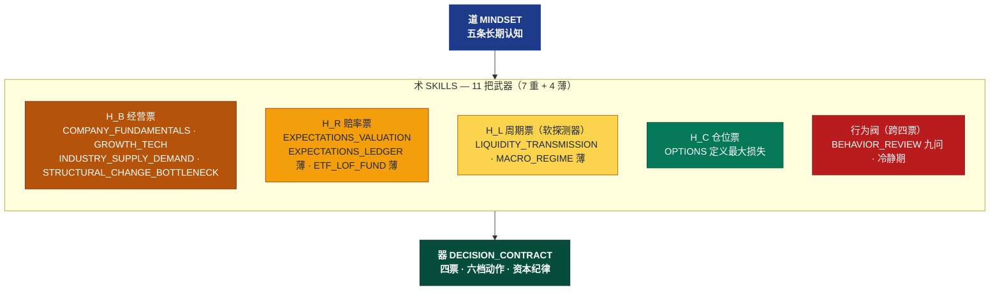

# Skills

## 先说人话

**目标：**把任何研究问题、信息素材、市场事件转化为 [[02_术/TRADING_SYSTEM/00_DECISION_CONTRACT|四票承保结论]] 和六档动作。Skill 提供目标和边界，不规定具体路径——路径由 AI 自主探索。

**怎么用：**拿到素材先判断属于哪一类（经营 / 赔率 / 周期 / 仓位 / 行为），打开对应 Skill 读它的职责、失败条件、"不能证明什么"，然后回到决策合同过四票。**没有任何 Skill 能直接授权交易**。

## 武器地图



## 道器对位 — 每条道对应哪件武器

| 道（[[01_道/MINDSET]] 原则） | 武器（术） | 防的什么错 |
|---|---|---|
| ① 利从哪里来 | [[02_术/SKILLS/COMPANY_FUNDAMENTALS]] + [[02_术/SKILLS/GROWTH_TECH]] | 把叙事、TAM、调整后 EBITDA 当利润 |
| ② 变化如何变利润 | [[02_术/SKILLS/INDUSTRY_SUPPLY_DEMAND]] + [[02_术/SKILLS/STRUCTURAL_CHANGE_BOTTLENECK]] | 必经≠好投资；稀缺被扩产消灭 |
| ③ 现实与价格为何分离 | [[02_术/SKILLS/EXPECTATIONS_VALUATION]] + [[02_术/SKILLS/LIQUIDITY_TRANSMISSION]] + MACRO_REGIME + EXPECTATIONS_LEDGER + ETF_LOF_FUND | 把水位上涨当公司变强 |
| ④ 人为何容易犯错 | [[02_术/SKILLS/BEHAVIOR_REVIEW]] | 顺着找理由、AI 共识、回本愿望 |
| ⑤ 如何长期生存 | [[02_术/SKILLS/OPTIONS]] + 决策合同四票 | 没定义最大损失就下场 |

## 最简流程

```text
1. 定向 → 素材属于哪类？（经营 / 赔率 / 周期 / 仓位 / 行为）
2. 调用 → 打开对应 Skill，读职责、失败条件、不能证明什么
3. 承保 → 把 Skill 输出过 [[02_术/TRADING_SYSTEM/00_DECISION_CONTRACT]] 四票
4. 输出 → 六档动作之一
```

具体怎么调研、怎么组合、怎么深挖，由 AI 自主判断。**Skill 给边界，不给配方。**

## 11 把武器

### H_B 经营票族 — 公司是否真赚钱

| Skill | 去哪里用 | 失败条件 |
|---|---|---|
| [[02_术/SKILLS/COMPANY_FUNDAMENTALS]] | 财报、收入成本拆解、现金转化、概念到财务路径 | 增长留不下利润或现金 |
| [[02_术/SKILLS/GROWTH_TECH]] | 高增长、未盈利、AI Token、稳定币、RWA | 兑现阶梯断裂、TAM 不能转化每股 FCF |
| [[02_术/SKILLS/INDUSTRY_SUPPLY_DEMAND]] | 付款人、供给反噬、利润池、周期与存储、Token 传导 | 需求无法穿透到收入、毛利、现金流 |
| [[02_术/SKILLS/STRUCTURAL_CHANGE_BOTTLENECK]] | 新主题、必经点、瓶颈迁移、三年三倍反推、AI 主线 | 客户自建、替代、扩产、监管使瓶颈失效 |

### H_R 赔率票族 — 价格给的回报够不够

| Skill | 去哪里用 | 失败条件 |
|---|---|---|
| [[02_术/SKILLS/EXPECTATIONS_VALUATION]] | 三层肉、五种估值语法、市场在相信什么、反推情景 | 估值依赖伪概率、旧成本价或未校准目标价 |
| [[02_术/SKILLS/EXPECTATIONS_LEDGER]] 薄壳 | 市场当前隐含预期、证伪事件日程 | 无法写清预期分母或证伪事件 |
| [[02_术/SKILLS/ETF_LOF_FUND]] 薄壳 | ETF/LOF 折溢价、包装层分账、申赎路径 | 无法验收持仓、申赎、退出深度 |

### H_L 周期票族 — 软探测器（权重弱于其他三票）

| Skill | 去哪里用 | 失败条件 |
|---|---|---|
| [[02_术/SKILLS/LIQUIDITY_TRANSMISSION]] | 四级水（政策/市场/板块/标的）、四坐标、顺风/分化/逆风、认知退出 | 只有政策或价格，无市场/板块/标的连续证据 |
| [[02_术/SKILLS/MACRO_REGIME]] 薄壳 | 宏观状态、传导假设 | 宏观信号无法传到需求、订单、利润 |

### H_C 仓位票族 — 错了能否活下来

| Skill | 去哪里用 | 失败条件 |
|---|---|---|
| [[02_术/SKILLS/OPTIONS]] | 定义最大损失、合约义务、退出路径、Roll 频率诊断 | 退出依赖运气、融资或持续 Roll |

### 行为阀 — 跨四票的道德阀

| Skill | 去哪里用 | 失败条件 |
|---|---|---|
| [[02_术/SKILLS/BEHAVIOR_REVIEW]] | 情绪触发词、亏损、踏空、AI 共识、抄底、卖 Put 降成本 | 顺着找理由、亏损后无新增经营证据却加风险 |

## 入口表（旧方法合并用）

| 入口 | 用途 |
|---|---|
| [[02_术/SKILLS/METHOD_ABSORPTION_MAP]] | 旧方法到 canonical Skill 的吸收映射 |
| [[02_术/SKILLS/METHOD_SOURCE_REVIEW_QUEUE_INDEX]] | 44 个旧方法来源的全文入队索引 |
| [[02_术/SKILLS/METHOD_SOURCE_MERGE_STATUS]] | 旧方法来源逐段合并状态 |

## 不要做什么

- 不要把 Review Queue 当 canonical Skill——旧方法不会因为复制进新结构就自动恢复权限
- 不要让单个 Case 直接生成长期原则
- 不要让方法更新绕过 [[02_术/TRADING_SYSTEM/00_DECISION_CONTRACT]]
- 不要在没有失败条件的情况下输出结论
- 不要在同根信息被多个 AI 或媒体重复时提高置信度——同根只计一次
- 不要把薄壳（MACRO_REGIME / EXPECTATIONS_LEDGER / ETF_LOF_FUND）当作已 canonical 使用——它们目前只声明职责，没有执行步骤和验证清单
- 不要给单一 Skill 授权交易——四票必须各自独立通过
- 不要把 H_L 周期票当硬门——它是软探测器，权重弱于其他三票
- 不要把价格下降写成 H_B 经营胜率提高——价格下降只允许改善 H_R 赔率票
- 不要在亏损、踏空、想回本、AI 共识时跳过 [[02_术/SKILLS/BEHAVIOR_REVIEW]] 的九问反方审查
- 不要给 AI 写详细 SOP——Skill 给目标和边界，路径由 AI 自主探索
