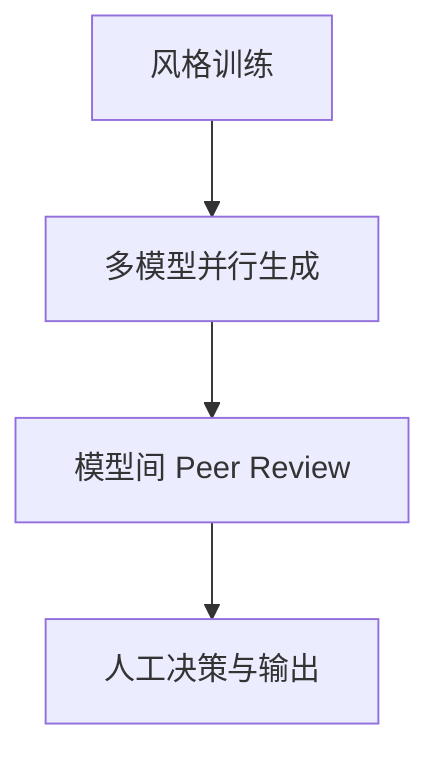

## 信号洞见

```
┌─────────────────────────────────────────┐
│           核心观点结构框架               │
├─────────────────────────────────────────┤
│  问题：稳定币发行变成红海，估值如何突围？  │
│  ├── 表现：发行规模增长停滞，管道业务不赚钱│
│  ├── 根因：法币进出模式下，发行商无议价权 │
│  └── 解决：转型 AI Agent 支付基建 + 研究提效│
└─────────────────────────────────────────┘
```

- **结构性观点**: 稳定币不是资产，是管道。未来的价值增量不在于“谁在发币”，而在于“谁在为 Agent 之间的交互提供支付结算层”。Circle 的暴涨是市场将其从“利息收益模式”重估为“SaaS/支付基础设施模式”。
- **可复用模式**: **“交叉验证”研究法**。利用不同大模型（GPT, Gemini, Grok）的视角差异和偏见，互相进行 Peer Review，能有效降低单一模型的幻觉风险，提升深度研究的产出效率。

## 水下信息

- **[商业潜规则]**: Circle 与 Coinbase 的“不平等条约”——Circle 需将 56% 的收入分给 Coinbase，且协议永续续约。Coinbase 既无动力收购，也无动力放手，导致 Circle 长期面临利润天花板。（信号判断：符合“行业潜规则”和“跨案例共性”）
-   **[技术刚需]**: AI Agent 支付是银行系统无法满足的刚需。Agent 需要跨生态、跨境、实时的微支付（如毫秒级税收结算），传统金融基础设施做不到，只有链上稳定币能做到。（信号判断：符合“越学越简单”，Agent 经济的底层物理限制）
-   **[战略对标]**: Stripe vs Circle 的战略挤压。Stripe 从支付入口向内切稳定币（降低成本），Circle 从资产发行向外切支付服务（提高天花板），两者最终将在同一战场相遇。（信号判断：符合“反复出现”的商业竞争模型）

## 金句

> "Agent 支付叙事正好击中了市场空头最密集的位置，一波逼空就来了。"
> — 关于 Circle 暴涨的市场心理分析

> "超级个体时代，真的来了。"
> — 关于 AI 赋能个人投资研究能力的感叹

## 方法论（基于案例）

### 案例支撑
-   **时间**: 近期日常实践
-   **操作**: 迪总利用 AI 模型群进行投资研究
-   **结果**: 一天产出 7-8 篇高质量深度文章，且通过模型互相审查保证了质量。

### 核心步骤


1.  **风格训练**: 将朋友或优秀的投资风格“训练”进基础模型，确立输出的分析框架和调性。
2.  **多模型并行**: 同时使用 GPT、Gemini、Grok 等不同模型针对同一主题生成报告，利用各模型的数据偏差异。
3.  **交叉验证**: 让不同模型互相作为“审稿人”进行 Peer Review，挑出对方的数据错误或逻辑漏洞，去伪存真。

---

**信号评估**: ✅ 穿越时间 | ✅ 反复出现 | ✅ 越学越简单
**原始链接**: [https://www.xiaoyuzhoufm.com/episode/69ace2b85b2d0ed069dfa12b](https://www.xiaoyuzhoufm.com/episode/69ace2b85b2d0ed069dfa12b)