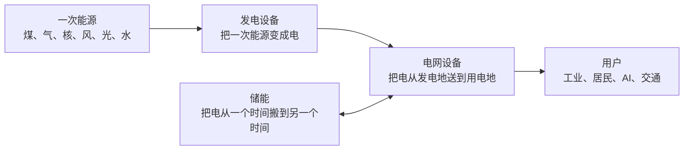

# 20260712 能源认识

> 投资电力与储能方向时，先记住一条最重要的认知坐标：
> **储能最大的服务对象是新能源电力系统，不是手机、汽车或数据中心；它的核心价值，是把不可控的风光发电变成能够按时间出售的电。**

## 一、储能真正影响的是谁

抛开AI数据中心，储能设备最主要影响的不是消费电子，而是：

> **电力系统，尤其是风电、光伏等新能源发电产业。**

因为风光最大的物理问题不是发不出电，而是：

```text
发电时间 ≠ 用电时间
```

中午光伏发电最多，但居民和工业用电高峰可能在傍晚。储能就是把中午的电搬到晚上。

### 主要影响的产业排序

| 排名 | 产业 | 储能解决什么 |
|---:|---|---|
| 1 | 风电、光伏新能源 | 减少弃风弃光，把波动电源变成可调度电源 |
| 2 | 电网、电力市场 | 削峰填谷、调频、备用容量、稳定频率 |
| 3 | 工商业用电 | 低价充电、高价放电，降低需量电费 |
| 4 | 充电站、重卡与交通电气化 | 缓解大功率充电对配电网的瞬时冲击 |
| 5 | 微电网、海岛及偏远地区 | 配合风光，减少柴油发电 |
| 6 | 家庭储能 | 光伏自发自用、停电备用 |
| 7 | 数据中心 | UPS、削峰、备用和绿电调度 |

所以储能最核心的需求链是：

```text
风光装机增加
→ 发电波动增加
→ 电网调峰压力上升
→ 储能需求增加
```

### 关键修正：付款人不是消费者

> 消费者对电量最敏感，但真正购买大规模储能设备的付款人，主要是电网、新能源开发商、工商业业主和能源企业。

2028年前可见度的市场大小排序：

```text
新能源配储 + 独立电网侧储能
>
工商业储能
>
充电站和微电网
>
家庭储能
```

### 储能对不同产业的具体作用

**风电和光伏**

没有储能时：

```text
中午光伏发电太多
→ 电网消纳不了
→ 限电、弃光、电价下降
```

加入储能后：

```text
中午充电 → 晚高峰放电
→ 提高光伏电站有效收入
```

储能本质上提高的是风光电站的"可使用率"和"可出售价值"。

**电网**

电网最怕供需瞬间不平衡：
- 发电多于用电，频率会上升；
- 发电少于用电，频率会下降；
- 偏离过大可能导致设备脱网甚至停电。

储能可以快速充放电，像电网的减震器。

**工商业**

工厂白天用电贵、夜间用电便宜：

```text
夜间低价充电 → 白天高价放电 → 赚峰谷电价差
```

但它是否赚钱，主要取决于峰谷价差、每天循环次数、衰减和融资成本，而不是电池容量越大越好。

## 二、完整的电力流动框架

最关键的概念纠正：

> **储能不负责把石油、煤炭、核能变成电；发电设备负责能源转换，储能负责把电从一个时间搬到另一个时间。**



最简单的三句话：

```text
一次能源 → 电能：发电
发电地   → 用电地：电网
低谷时刻 → 高峰时刻：储能
```

核电站通过核反应产生热，再通过蒸汽轮机和发电机变成电；不需要经过电池。石油、煤炭和天然气也是通过燃烧、热机和发电机产生电。

**最重要的两个式子：**

\[ P = V \times I \]\[ E = P \times t \]

功率回答"这一刻能干多大的活"；能量回答"能干多久"。

## 三、储能需求由什么决定

> **储能需求 ≈ 发电曲线与用电曲线之间的不匹配**

不是"电力的量越大，需要的储能越大"。两个极端例子：

| 电力系统 | 总发电量 | 储能需求 |
|---|---:|---:|
| 大量核电、燃气、煤电，输出稳定可调 | 很大 | 未必很大 |
| 大量风电、光伏，输出随天气变化 | 同样大 | 明显更大 |

因此，要同时看：
- 总用电量是否增长；
- 用电高峰有多高；
- 风光占比是否提高；
- 发电与用电的时间是否错位；
- 火电、水电、核电能否调节；
- 电网能否跨区域调电。

核电比较稳定，反而可以减少一部分短期波动；光伏、风电越多，对储能和电网调节的需求越大。

### 电力的两个维度

| 指标 | 含义 | 影响什么 |
|---|---|---|
| 电量 `MWh` | 一天、一年总共用了多少电 | 发电能力、燃料及长期能源供给 |
| 功率 `MW` | 某一时刻最多需要多少电 | 电网、变压器、线路和备用容量 |

例如，一个工厂一年用电量不变，但把所有设备集中在白天启动：
- 总电量没有增加；
- 峰值功率显著上升；
- 变压器、线路和储能都可能需要扩容。

AI数据中心带来的特殊压力，主要是三件事叠加：

```text
总电量增长
+
单点功率密度增长
+
24小时稳定供电要求提高
```

### 电力质量 ≠ 高电压

电力质量真正包括：

| 指标 | 要求 |
|---|---|
| 电压 | 稳定在规定范围，不是越高越好 |
| 频率 | 稳定在50Hz附近 |
| 谐波 | 不能过多干扰设备 |
| 瞬时波动 | 不能突然跌落或中断 |
| 可靠性 | 停电概率和恢复时间足够低 |

高电压主要解决的是远距离、大功率输送效率：

```text
相同功率下提高电压
→ 电流降低
→ 发热和铜损降低
→ 可以输送更远、更大功率
```

但是用户设备最终需要的是合适且稳定的电压，而不是无限高电压。

> 电网扩容需要更高输送能力；高电压只是提高输送能力的一种方法，变压器、开关、电缆、保护和控制系统必须一起升级。

## 四、电力扩容的五维度框架（取代"电量+电压"二分法）

不能简单分成"电量和电压"，更合适的框架是：

```text
电量：有没有足够的电
功率：某一时刻能提供多少电
网络：能不能把电送到需要的位置
灵活性：能不能把电搬到需要的时间
质量：电压、频率和可靠性能不能保持稳定
```

| 需求变化 | 真正受益环节 |
|---|---|
| 总用电量增加 | 发电设备、燃料、电网 |
| 峰值功率增加 | 变压器、线路、开关、备用电源 |
| 风光占比增加 | 储能、电网调度、功率预测、柔性输电 |
| 可靠性要求提高 | UPS、储能、继电保护、电网自动化、功率器件 |

### 储能 vs 电网：互补不是替代

它们不是互相替代，而是互补：

| 电网设备 | 储能 |
|---|---|
| 扩大"管道" | 增加"蓄水池" |
| 解决空间错配 | 解决时间错配 |
| 把西部风光送到东部 | 把中午光伏搬到晚上 |
| 主要看峰值功率和输送距离 | 主要看波动、峰谷价差和持续时间 |

未来只增加储能、不建设电网，电仍然送不出去；只建设电网、不增加灵活性，高比例风光仍可能在错误的时间集中发电。

## 五、电力系统的核心瓶颈图

| 环节 | 内在物理瓶颈 | 商业供给特征 | 是否是真瓶颈 |
|---|---|---|---|
| 发电 | 必须持续产生足够电量，储能本身不会发电 | 电源建设、燃料、并网周期长 | **最底层瓶颈** |
| 电网接入 | 线路热容量、短路容量、电网稳定性 | 审批、土地、线路建设很难靠资本瞬间扩产 | **很强的真实瓶颈** |
| 变压器/开关设备 | 绝缘、散热、电弧切断、长期可靠性 | 定制、认证、试验和交付周期长 | **2028年前较确定** |
| 数据中心高压供电 | 高压可降低电流，但增加绝缘、直流灭弧和保护难度 | 800V DC生态正在形成，标准尚未完全固化 | **新兴瓶颈** |
| LFP储能电芯 | 循环衰减、热失控、一致性和系统安全 | 中国电芯产能充足，容易被资本扩产 | **需求大，但未必供给稀缺** |
| 液态电解液 | 界面膜稳定、低温、高温、阻抗及安全 | 普通产能较多，高端配方和稳定交付更有价值 | **局部瓶颈，不是总瓶颈** |
| 固态电解质 | 固固接触、界面阻抗、枝晶、薄层制造和良率 | 尚未形成稳定大规模供给 | **技术瓶颈，但未必很快成为利润池** |
| 10–20小时储能 | 成本随储能时间增加、效率和寿命权衡 | 液流、压缩空气等都依赖工程和场址 | **路线未定，是系统瓶颈** |

美国能源部披露，普通配电变压器交付周期曾从3–6个月拉长至1–2年，大型变压器可达3–4年，说明电力设备的短缺比普通锂电材料更"硬"。[美国能源部变压器供应链说明](https://www.energy.gov/oe/distribution-transformer-webinar-text-alternative)

## 六、关键直觉的纠正

| 直觉 | 更准确的说法 |
|---|---|
| 储能把石油煤炭核能变成电 | 不对。那是发电设备的事。储能只负责把电从一个时间搬到另一个时间 |
| 电量越大，储能需求越大 | 不完全对。储能需求≈发电曲线与用电曲线的错配；核电煤气电量很大，但储能需求未必大 |
| 消费者对电量敏感→To C储能最大 | 错。真正购买大规模储能的付款人是电网、新能源开发商、工商业业主和能源企业 |
| 电池容量越大越好 | 系统可以不断并联电芯扩大容量，真正的问题是每度电花多少钱、占多少空间、增加多少安全风险 |
| 功率越大越好 | 高功率会带来更大电流、发热、极化和衰减；应当是"够用且经济" |
| 电压越高越好 | 同等功率下，高电压可降低电流和铜损，但绝缘、灭弧、保护和功率变换更难 |
| 固态电解质离子搬运更快 | 不一定。固态内部电导率可能很高，但固体与电极的接触比液体浸润困难，界面反而更容易成为瓶颈 |
| 固态电池最适合储能 | 固态的最大价值是安全和能量密度；固定式储能不太在乎重量，因此未必愿意为高能量密度付溢价 |
| AI需要大电池 | AI首先需要更多持续发电和更强电网；电池只能搬运已有电量，不能替代电源 |
| 油价越高，新能源需求越大 | 关系没有那么直接。多数电力不是石油发的，更重要的是煤气价格、电价、融资成本、政策和电网消纳能力 |

你的 MacBook 例子证明的是：

> AI程序让电脑的平均功率从"低档"进入"高档"，所以同一块电池更快耗完；它证明AI耗电，不直接证明固态电池或长时储能必然短缺。

## 七、2028年前的储能路线判断

| 储能时长 | 更可能的主路线 | 核心理由 |
|---|---|---|
| 毫秒—分钟 | 超级电容、飞轮、BBU、高功率锂电 | 响应速度最重要 |
| 1–4小时 | LFP锂电 | 成熟、便宜、供应链完整 |
| 5–10小时 | **LFP仍是主力**；钠电补位 | LFP拥有规模、融资和运维优势 |
| 10–20小时 | 液流、压缩空气、部分LFP并存 | 开始更重视能量成本、寿命和场址 |
| 数天 | 铁空气、氢、热储能等 | 牺牲效率，换取极低储能介质成本 |

截至2025年底，中国新型储能中锂离子电池仍占96.1%，平均时长只有2.58小时；这说明长时储能是未来方向，但还不是当下主流。[国家能源局2025年储能数据](https://www.nea.gov.cn/20260130/50f657ce87f848e1a9a1861d1fd9aa23/c.html)

所以，2028年前不存在一个"最优电池"：

- 5–10小时：LFP胜在成熟和便宜。
- 10–20小时：液流、压缩空气开始有相对优势。
- 全固态：更像技术期权，不是长时储能的确定赢家。

## 八、AI供电的真实瓶颈

AI数据中心需要同时解决四个时间尺度：

| 时间尺度 | 解决什么 | 主要设备 |
|---|---|---|
| 毫秒—秒 | GPU负载突然跳升 | 电容、BBU、功率器件 |
| 秒—分钟 | 电网闪断、切换备用电源 | UPS、锂电、飞轮 |
| 数小时 | 削峰、停电备用、绿电搬运 | BESS、柴油机、燃气机、燃料电池 |
| 长期持续 | 每天24小时的基础电量 | 电网、核电、燃气、风光及配套储能 |

高电压为什么有需求？因为同样输送1MW功率：

- 54V需要约18,500A；
- 800V只需要约1,250A。

电流降低后，铜排、发热和空间压力都明显下降。因此英伟达计划从2027年前后推动800V DC架构支持MW级机架，但直流保护、绝缘、功率变换和标准化仍需完善。[NVIDIA 800V DC架构](https://developer.nvidia.com/blog/?p=100571)

## 九、对天赐材料的映射

只有使用锂电、钠电等电化学路线，才会直接消耗天赐的电解液：

| 储能路线 | 对天赐影响 |
|---|---|
| 2–10小时LFP储能 | 直接利好 |
| 钠离子储能 | 潜在利好 |
| 半固态/固态 | 长期技术期权 |
| 液流电池 | 相关性弱 |
| 压缩空气、抽水蓄能 | 基本无直接关系 |
| 熔盐、储热 | 基本无直接关系 |

### 天赐是不是占据真实瓶颈？

结论是：

> 天赐占据了一个"必需环节和成本优势节点"，但暂时还不是AI能源系统最稀缺、最不可替代的瓶颈。

它的真实价值在于：

- LFP储能放量必然消耗电解液；
- LiPF6一体化、自供和规模制造能降低成本；
- 配方、杂质控制、客户认证及稳定交付不是简单搅拌；
- LiFSI和高安全添加剂可能提高产品价值。

但要克制：

- 普通电解液扩产周期相对短，金融资本容易把短缺变成过剩；
- 10小时以上如果转向液流、压缩空气、铁空气，就不再消耗锂电电解液；
- 固态电解质目前是技术储备，不是已经验证的利润瓶颈。

## 十、投资判断方法

研究一个电力方向时，先问它解决哪种短缺：

1. **缺总电量**：看发电。
2. **缺峰值功率**：看变压器、开关和备用容量。
3. **电送不过去**：看输电线路、变电站和电网设备。
4. **发电和用电时间错位**：看储能。
5. **电不够稳定**：看电网控制、保护、无功补偿、UPS和功率器件。

最后再问三件事：

```text
需求增长速度 > 供给扩张速度吗？
订单增长能变成毛利和现金流吗？
市场价格已经提前反映多少？
```

判断一个环节能不能留下利润，可以用这句非常朴素的话：

> 钱能快速解决的产能，不是长期瓶颈；钱来了仍然解决不了的认证、良率、可靠性、场址和并网权，才是真瓶颈。

因此，2028年前我会这样排序：

1. **电网接入、变压器、开关保护：最确定的现实瓶颈。**
2. **数据中心高压直流与功率变换：正在形成的新瓶颈。**
3. **储能系统安全、寿命和集成：真实但竞争激烈。**
4. **普通电芯与普通电解液：需求很大，但供给未必少。**
5. **固态电解质：技术很难、赔率很高，但商业兑现尚早。**

## 十一、四个主要标的的综合排序（2026-07-12 核验）

> **长期最确定的方向是电网设备；当前价格下赔率更高的是储能材料；风险调整后最合适的小仓标的是天赐材料。**

如果追求"最纯的AI电力逻辑"，选电网设备；如果追求"预期差和利润上修弹性"，当前材料端更占优。

### 方向 vs 赔率：不是同一个答案

| 方向 | 基本面确定性 | 市场定价 | 当前赔率 |
|---|---|---|---|
| 电网设备 | 最高 | 已经交易充分 | 中等 |
| 天赐材料 | 中高 | 经历明显回撤 | **中高** |
| 湖南裕能 | 中等 | 同样大幅回撤 | 高弹性、高风险 |
| 四方股份 | 行业方向强，公司兑现弱 | 仍然偏贵 | 偏低 |
| 储能系统/PCS | 订单强 | 利润归属不清楚 | 中等 |

```text
电网设备：好生意，但市场已经知道
储能材料：周期不稳定，但盈利上修可能超预期
```

### 政策有没有真正落到订单？

已经部分落地，不只是口号。

**电网**——"十五五"期间新型电网投资预计超过5万亿元，主要投向输电通道、特高压、城市配网和县域电网改造。[国家能源局相关披露](https://xbj.nea.gov.cn/dtyw/hyxx/202605/t20260529_302145.html)

正式规划还提出：

- 2030年新型储能装机达到3亿千瓦；
- 配电网具备承载9亿千瓦分布式新能源的能力；
- 加强跨区输电、智能调度和主配微协同。["十五五"能源规划](https://www.ndrc.gov.cn/xwdt/tzgg/202606/P020260625613973397386.pdf)

**储能**——2026年上半年：

- 储能系统招标148.1GWh，同比增长88.3%；
- 储能EPC招标227.9GWh，同比增长112.2%；
- 电网侧占EPC招标能量的88.2%；
- 2小时和4小时系统价格分别同比上涨8.8%和21.1%。[CNESA上半年招标数据](https://research.cnesa.org/report/info/?id=6944)

但要区分：

```text
行业有订单 ≠ 每家公司都有利润
```

材料端已经有天赐、湖南裕能、新宙邦、恩捷的财务证据；四方的AI数据中心/SST业务仍没有单独披露订单、收入和毛利率。

### 四个标的分项

**1. 天赐材料：当前最综合**

优势：H1归母净利润预告27–30亿元；电解液、六氟需求、价格和利用率共同改善；当前约817亿元市值，按55–60亿元全年利润计算约13.6–14.8倍PE；市场担心供给增加、利润见顶，反而形成预期差。

问题：Q2利润低于Q1；Q1经营现金流为负；应收和存货增长快；固态、钠电仍只是期权。

> **判断：最适合建立20%–30%计划仓位的底仓，但不能直接重仓。赚的是H2利润继续上修和市场发现2027利润没有崩掉的钱。**

**2. 湖南裕能：原始弹性最大，但质量弱于天赐**

Q1净利润13.56亿元，收入149.65亿元，但经营现金流为负10.45亿元。[湖南裕能2026Q1报告](https://money.finance.sina.com.cn/corp/view/vCB_AllBulletinDetail.php?id=12217027&stockid=301358)

当前约535亿元市值，如果全年利润能达到50亿元，看起来只有约11倍PE，弹性很大。但Q1包含产品涨价和库存收益；下游客户议价能力强；现金流明显差；LFP新增供给重新释放后利润可能快速回落。

> **判断：上涨赔率可能高于天赐，但胜率和利润质量更低。适合等H1毛利率、库存收益和现金流拆清楚后再买。**

**3. 电网设备ETF `159326`：方向最好，买点一般**

买的是特变电工、思源电气、国电南瑞、亨通光电和中天科技，符合"更强电网"的长期方向。但截至5月底，跟踪指数过去一年约上涨97%；PE约36倍，估值明显高于历史中枢。[中证指数官方资料](https://oss-ch.csindex.com.cn/static/html/csindex/public/uploads/indices/detail/files/zh_CN/931994factsheet.pdf)

近期虽然已经回调，但更像从高位回落，不是明确低估。

> **判断：可作长期观察和分批配置方向，但当前赔率不如材料。更理想的加仓条件是指数估值回到30倍以内，或利润增长把PE自然消化下来。**

**4. 四方股份：暂时不作为首选**

不是传统变压器公司，核心是继电保护、电网自动化、电力电子和SST。正面：主业真实；Q1收入和利润继续增长；SST覆盖中压交流到800V DC方向；已参与部分数据中心项目。问题：AI数据中心/SST没有独立订单和收入披露；综合毛利率从2023年的34.4%下降至2025年的30.2%；7月10日约54.55元，对应市值约454亿元，仍相当于约50倍左右盈利。

> **判断：它是"正确方向里的昂贵期权"，不是当前最高赔率标的。需要等SST订单和毛利率出现，或价格进一步回落。**

### 最终排序

| 维度 | 排序 |
|---|---|
| 长期确定性 | 电网设备ETF > 四方传统主业 > 天赐材料 > 湖南裕能 |
| 当前上涨弹性 | 湖南裕能 > 天赐材料 > 电网设备ETF > 四方股份 |
| **风险调整后综合性价比** | **天赐材料 > 电网设备ETF > 湖南裕能 > 四方股份** |

### 资本动作

| 方向 | 当前动作 |
|---|---|
| 天赐材料 | 可建小底仓，等H1现金流和Q3价差决定是否加仓 |
| 湖南裕能 | 暂缓，等H1确认Q1利润是不是库存收益 |
| 电网设备ETF `159326` | 小跟踪仓或等待，不追高 |
| 四方股份 | 继续观察，等SST订单/收入或更低估值 |
| `159566` | 它是电池与储能系统ETF，不是电网设备工具 |

> **AI带来的电网扩容是更确定、更长期的产业方向；但因为电网股已经提前上涨，当前最好赔率反而可能在被市场质疑、但利润已经开始兑现的材料龙头——其中天赐比湖南裕能更均衡。**

油价波动只能作为二级变量。真正应该监控的是电网投资、储能招标、电芯排产、材料价差、企业毛利率和经营现金流。

## 十二、投资假设与跟踪（贝叶斯 / 泊松 / 幂率）

每个标的 = **一个先验 + 一组跟踪信号 + 一组触发事件**。

| 标的 | 核心假设（先验） | 关键跟踪信号（似然） | 加仓触发 | 减仓 / 不买触发 |
|---|---|---|---|---|
| **天赐材料** | H2 利润继续上修 + 2027 不崩 | 电解液价差、六氟价格、Q3 经营现金流、应收/存货 | 现金流回正 + 价差走阔 | 毛利率连续两季下滑 |
| **湖南裕能** | Q1 利润不是库存收益 | H1 毛利率、H1 经营现金流、LFP 新增供给节奏 | 现金流回正 + 毛利率维持 | 库存收益证伪 + 应收暴涨 |
| **电网 ETF `159326`** | "十五五" 5 万亿电网投资 | 跟踪指数 PE、国网招标量、特高压投资完成额 | PE 回到 30 倍以内 | PE > 40 且利润不达 |
| **四方股份** | SST / 数据中心订单能独立兑现 | SST 独立披露、综合毛利率、新签订单 | SST 收入独立 + 毛利率止跌 | SST 延迟 + 毛利率续跌 |

**三条原则：**

- **贝叶斯**：上表是当前先验；每份财报、每次招标、每个价差都是一次似然更新，后验排序随之变化——不与原判断绑定。
- **泊松**：核心事件（独立披露、大单落地、政策出台、价差突破）按离散节奏到达——用等待代替预测，加仓跟随事件，不跟随情绪。
- **幂率**：电力扩容是 10 年周期，赛道头部集中——给已确认的龙头（电网设备、天赐）更高权重，避免均匀分散。

## 一句话总结

> 未来电力系统扩容，不是"电量＋电压"，而是"更多发电＋更强电网＋更多灵活性＋更高可靠性"；储能解决时间错配，电网解决空间和功率错配，两条主线都重要，但受益条件不同。AI需要的不只是"大电池"，而是一条从发电、电网、变压器、功率转换到储能的完整电流通道；当前最硬的短板更偏向"电送不进去"，长期才是"电能不能低成本存十几个小时"。
