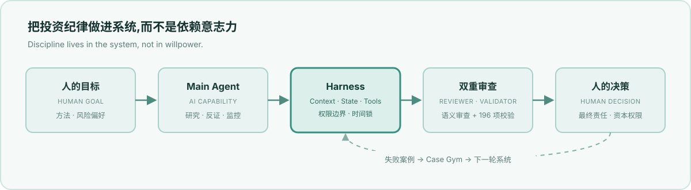

<div align="center">

# 投资 Agent Harness

**把投资纪律做成系统，而不是依赖意志力。**

*Discipline lives in the system, not in willpower.*

</div>

<picture>
  <source media="(prefers-color-scheme: dark)" srcset="./assets/harness-map-dark.svg">
  <source media="(prefers-color-scheme: light)" srcset="./assets/harness-map-light.svg">
  
</picture>

## 先说结论

这是一个以个人投资为实验场的 **AI Harness Engineering 项目**：让通用大模型在明确的 Context、State、权限与校验之下，长期稳定地服务于一个真实目标。人类保留最终决策权，AI 负责研究、反证、监控与执行纪律。

| 主张 | 证据 |
|---|---|
| 纪律不靠意志，靠结构 | 时间锁 · 四票分立 · Maker–Checker |
| 每次输出可机械校验 | Validator **196 项测试**，CI 持续检查 |
| 错误成为系统资产 | Case Gym：失败案例 → 规则 → 自动检查 |
| 权限属于人 | AI 无资本决策权，merge 必须由人执行 |

边界：不预测市场，不保证收益，不自动交易。

我真正想解决的并不是"让 AI 帮我炒股"，而是一个更一般的问题：

> **如何把通用大模型，组织成一个理解我的方法、遵守我的纪律、能够长期稳定工作的决策辅助系统。**

因此，我没有从"做一个更聪明的投资 Agent"开始，而是把投资过程重新拆成：

```text
投资目标
   ↓
明确赚什么钱
   ↓
定义判断方法
   ↓
AI 负责信息处理与反证
   ↓
Harness 固化流程与权限
   ↓
Evaluator / Validator 检查
   ↓
人类最终决策
   ↓
案例沉淀 → 系统继续进化
```

系统运行在我的 Obsidian 仓库中：投资宪法、交易规则、当前判断、证据、失败案例和 Agent 行为边界全部文件化；模型可以更换，系统结构保持稳定。

目前它主要解决三件事：

- **减少注意力消耗**——持仓一到两个月不需要持续盯盘，由到期扫描和事件检查替代；
- **降低行为错误**——加仓、抄底等高风险动作必须经过冷静期和独立审查；
- **提高决策可追溯性**——任何判断都能还原到当时使用的证据、规则和上下文。

它不预测市场，不保证收益，也不自动交易。

这个项目真正验证的是：

> **AI 的价值不只来自模型能力，更来自我们如何设计 Context、State、Skill、Tool、Evaluation 和 Human-in-the-loop，让能力稳定地服务于一个真实目标。**

---

## 一、情景：绕不开的投资理财

我有主业，也有需要长期管理的个人资产。投资对我来说不是兴趣消遣，而是一个长期存在的现实问题：

```text
收入 → 形成储蓄 → 资产需要配置 → 必须承担一定风险 → 需要持续做判断
```

问题在于，投资天然会与主业争夺最稀缺的资源——**注意力**。

每天刷行情、读研报、判断涨跌原因，看似是在研究投资，实际上很容易变成一种低质量的信息消费。

所以我真正的问题并不是"怎样每天获得更多市场信息"，而是：

> **怎样用更少的人类注意力，做出更稳定、更可复盘的投资决策？**

这是整个系统的起点。

---

## 二、冲突：两个绕不开的难

### 难题一：想获得收益，又必须先控制损失

投资不存在"高收益、低波动、零风险"的免费午餐。所以系统首先不问"买什么"，而是先问：

> **我准备赚什么钱？我愿意承担什么风险？什么情况下这套逻辑算失败？**

收益和风险不是两个独立问题，而是一体两面。我的目标函数不是单纯追求收益最大化：

```text
先避免永久性资本损失
        ↓
控制单次错误成本
        ↓
在可承受风险下寻找赔率
        ↓
提高长期风险调整后收益
```

系统首先管理错误，然后才讨论收益。

### 难题二：短期波动会系统性破坏人的判断

真正难的并不是"知道更多"，而是：

> **人在波动中，很难始终按照冷静时制定的方法行动。**

典型表现：

- 跌了以后临时修改原来的判断；
- 因为浮亏产生补仓冲动；
- 因为上涨害怕踏空；
- 高频查看价格后，把短期波动误认为基本面变化；
- 不断寻找新的信息，为已经想做的事情提供理由。

行为金融学对此早有结论：

| 现象 | 研究结论 |
|---|---|
| 高频查看损益 | 更容易产生短视损失厌恶，降低风险资产持有意愿 |
| 处置效应 | 投资者更容易卖出盈利资产，却长期持有亏损资产 |
| 过度交易 | 高频交易显著侵蚀个人投资者长期收益 |
| 注意力买入 | 投资者倾向购买新闻多、涨幅大、成交活跃的"注意力资产" |

所以核心判断是：

> **最大的风险不只是市场判断错误，而是人在波动中不断修改自己的决策规则。**

如果问题出在人本身，仅仅增加一个"更聪明的 AI"解决不了——因为 AI 同样可以被说服。我最早就试过：

```text
我产生冲动
   ↓
找 AI 讨论
   ↓
AI 开始劝我冷静
   ↓
继续给 AI 输入理由
   ↓
AI 最终接受我的逻辑
```

这次失败让我意识到：

> **不能依赖 AI 的"人格稳定"，必须依赖系统结构。**

---

## 三、答案：把投资做成一个系统

答案分三步：

> **先定义赚钱逻辑，再定义人机分工，最后才设计 Harness。**

### 第一件事：先想清楚赚什么钱

多数投资讨论从"买什么"开始，我的系统从另一个问题开始：

> **这笔投资到底准备赚什么钱？**

主要收益来源压缩成三类：

| 收益来源 | 本质 | 典型载体 | 核心观察变量 |
|---|---|---|---|
| 宏观流动性 | 水位变化与资产重估 | 黄金、比特币、大类资产 | 流动性、货币环境、稀缺性共识 |
| 行业 Beta | 行业景气趋势 | 行业 ETF | 景气度、供需、估值、拥挤度 |
| 个股 Alpha | 企业经营超预期 | 个股 | 订单、利润、现金流、竞争优势 |

这一步之所以重要，因为它决定后面的一切：

```text
赚什么钱 → 决定研究什么 → 决定买什么载体 → 决定持有多久 → 决定什么证据能证伪
```

用宏观逻辑买个股，又用公司逻辑解释 ETF，框架本身就已经错位。

系统因此要求：**任何正式投资判断都必须先声明收益来源和投资周期。**

### 第二件事：承认 AI 的强项和弱项，重新分工

AI 最擅长的是：

```text
大量信息 → 搜索 / 阅读 / 比较 → 结构化 → 寻找反例 → 追踪变化
```

人最应该保留的是：目标、价值判断、风险偏好、资本分配、最终决策。

因此系统不是"AI → 告诉我买什么"，而是：

```text
Human：定义目标与方法
          ↓
AI：收集、研究、反证
          ↓
Harness：限制执行路径
          ↓
Evaluator：检查判断
          ↓
Human：承担最终决策
```

两条设计原则：

> **AI 的一致意见不等于独立证据。**

多个模型可能共享相似的信息来源、训练偏好和推理模式，"几个 AI 都同意"不能自动提高事实置信度。

> **允许"不做"。**

如果一个动作不值得执行，"不做，因为 X"一句话就够。系统不鼓励为了显得完整而生产大量免责声明、解释和无效文本。

### 第三件事：造一套 Harness，把纪律做进结构

Harness 可以理解成 AI 的"架杆"：模型决定它理论上有多聪明，Harness 决定这种能力能不能稳定地服务于一个具体目标。

```text
                ┌─ Instructions ─ 方法与边界
                │
                ├─ Context ───── 当前需要知道什么
Goal ─ Harness ─┼─ Tools ─────── 可以做什么
                │
                ├─ State ─────── 当前世界是什么状态
                │
                └─ Feedback ──── 怎样知道自己做错了
```

它不修改模型权重，改变的是：

> **模型在什么信息、规则、权限和反馈机制下工作。**

这套 Harness 具体做了三件事。

#### 1. 把投资理念写进系统

投资方法不是一段超长 Prompt，而是被拆成按需加载的知识层：

```text
投资原则
├── 收益来源
├── 风险纪律
├── 判断框架
├── 动作规则
├── 错误案例
└── 当前状态
```

目标不是让模型"像我说话"，而是：

> **让系统稳定地产生符合这套方法论的行为。**

#### 2. 把调研方法做成流程

研究过程固定为：

```text
声明赚什么钱
      ↓
确定投资周期
      ↓
选择对应研究方法
      ↓
建立候选池
      ↓
负向筛选
      ↓
深度研究
      ↓
经营 / 赔率 / 周期 / 仓位评估
      ↓
形成有限动作
```

失败案例也不会只停留在复盘，它们进入：

```text
Mistake → Root Cause → Rule → Harness Change → Future Evaluation
```

真正有价值的不是"AI 又生成了一篇报告"，而是：

> **同一种错误以后是否更难再次发生。**

#### 3. 把纪律做进结构

纪律不寄托在"下次一定冷静"，而是设计成系统约束。

**四票分立**

```text
经营 H_B ─ 公司/资产本身是否成立
赔率 H_R ─ 当前价格是否值得承担风险
周期 H_L ─ 当前处于什么市场阶段
仓位 H_C ─ 应该承担多少资本风险
```

价格下跌可以改善赔率，但不能自动改善经营质量。因此：

> **Price ↓ ≠ Business Quality ↑**

**时间锁**

亏损后产生加仓、抄底等新增风险行为时，默认冻结 24 小时。目的不是判断市场，而是隔离情绪。

**Maker–Checker**

```text
Main Agent → Independent Reviewer → Validator → Human Merge
```

执行者不能自己给自己签字。

**判断过期机制**

每个 Thesis 都包含 `data_cutoff` 与 `expires_at`。系统关注的不是"我以前判断过什么"，而是：

> **哪些判断已经过期，需要重新验证？**

一句话：

> **我不要求 AI 永远理性，我让不理性的行为更难进入正式决策路径。**

---

### 架构速览（面向工程师）

最小 Context 加载链——不是全量加载，只让 Agent 读取当前任务真正需要的信息：

```text
AGENTS.md → PATHS.md → CONTENT_ROUTER.md → 命中的 Principle / Skill → Current State → Evidence
```

整体结构：

```text
                    Human
                      │
               Goal / Capital
                      │
                      ▼
              ┌─────────────┐
              │ Main Agent  │
              └──────┬──────┘
                     │
        ┌────────────┼────────────┐
        ▼            ▼            ▼
     Context       Skills       Tools
        │            │            │
        └────────────┼────────────┘
                     ▼
                  Result
                     │
          ┌──────────┴──────────┐
          ▼                     ▼
      Reviewer              Validator
     语义审查                机械校验
          │                     │
          └──────────┬──────────┘
                     ▼
                Human Decision
                     │
                     ▼
              State / Case Gym
                     │
                     └──────→ 下一轮
```

四票系统：

| 票 | 判断问题 | 核心证据 |
|---|---|---|
| H_B | 经营逻辑是否成立 | 订单、利润、现金流、竞争优势 |
| H_R | 当前赔率是否值得 | 价格与价值 |
| H_L | 当前周期是否合适 | 宏观、行业、拥挤度 |
| H_C | 应承担多少风险 | 总资本与风险预算 |

动作被压缩成六档：

```text
不投入 / 继续观察 / 建立验证仓 / 升级确认仓 / 不加仓 / 降级或退出
```

减少自然语言自由度，本身也是一种 Harness。

当前仓库中五类系统组件的落点：

```text
Instructions → AGENTS.md / 01_道
Context      → Router / Skills / Evidence
Tools        → 文件系统 / 搜索 / 校验脚本
State        → 03_STATE
Feedback     → Reviewer / Validator / Case Gym
```

另一条重要原则：

> **能确定性校验的事情，不交给概率模型。**

路径、时间、字段、引用完整性等规则交给 Validator；需要语义判断和反证的事情才交给模型。

---

## 四、结果：拿到了什么，没拿到什么

### 拿到的

**1. 注意力被释放。** 持仓周期通常一到两个月，我不再依赖每天看盘维持安全感，而是让系统检查：什么过期了、什么出现新证据、什么被证伪、什么需要重新研究。

**2. 决策可追溯。** 任何正式判断都能回答：当时为什么这么判断？依据是什么？用了哪套方法？后来什么发生了变化？为什么修改？

**3. 错误成为资产。**

```text
过去：踩坑 → 后悔 → 下一次可能再犯
现在：踩坑 → 进入 Case Gym → 提取 Failure Pattern → 变成规则 / Skill / Validator → 下一次自动检查
```

**4. 系统与模型解耦。** 模型可以升级，但投资宪法、Context、State、Evaluator、错误案例和流程不需要因为模型升级而推倒重来。目前 Validator 已覆盖 **196 项机械校验测试**，并通过 CI 持续检查。

### 没拿到的

边界同样重要：

| 问题 | 系统能做 | 系统不能做 |
|---|---|---|
| 情绪化决策 | 增加冷静期、审查和摩擦 | 消灭人的情绪 |
| 信息过载 | 过滤、去重、压缩、追踪变化 | 创造未知信息 |
| 判断质量 | 强制证据和反证 | 保证预测正确 |
| 投资收益 | 减少行为错误 | 承诺 Alpha |
| 人类责任 | 提供决策支持 | 替人承担资本责任 |

所以这个系统不是"一个可以替我赚钱的 AI"，而更接近：

> **一个降低认知损耗、强化决策纪律、持续积累经验的个人决策基础设施。**

投资最理想的状态，本来就应该有些无聊：系统在后台稳定工作，人把注意力留给更高价值的事情。

---

## 实用区

以上解释的是为什么造它，下面是它实际怎样工作。

### 实际使用起来什么样

以一到两个月的持仓周期为例：

```text
新材料
 ↓
AI 判断有没有信息增量
 ↓
重要内容进入 Evidence
 ↓
必要时更新 Thesis
 ↓
四票重新评估
 ↓
Reviewer 挑错
 ↓
Validator 检查
 ↓
我决定是否行动
```

实际体验的变化主要在四处：

- 新材料进入后，先判断是否存在增量，而不是默认全文阅读；
- 一百份重复研报不会变成一百份知识，只保留新增信息；
- "我想加仓"不会直接变成动作，而会先进入一次正式评估；
- 复盘不再依赖记忆，而是可以恢复当时完整的决策现场。

### 项目不做什么

- 不荐股；
- 不承诺目标收益；
- 不自动交易；
- 不授予 AI 最终资本决策权。

这不是免责声明，而是系统边界。我故意把 AI 放在 `Research / Counter-argument / Monitoring / Verification`，而不是 `Capital Authority`——权限设计本身就是 Harness 的一部分。

### 目录地图

```text
agentic-investment-harness/
│
├── 00_HOME/           路径索引 / Router
├── 01_道/             投资原则 / Guardrail
├── 02_术/             交易方法 / Skills / Parameters
├── 03_STATE/          当前 Thesis / Expectations
├── 04_CASE_GYM/       案例 / 错误库 / 交易日志
├── 05_EVIDENCE_META/  来源 / Evidence / Knowledge
├── 90_AUTOMATION/     Reviewer / Validator / Tests
└── 归档/               历史研究材料
```

这不是单纯的人类知识目录，它首先是一张：

> **Agent 应该在什么任务里读取什么 Context 的地图。**

### 五分钟跑测试

```bash
git clone https://github.com/bor799/agentic-investment-harness.git
cd agentic-investment-harness

# Validator 测试（196 项）
python3 -m unittest discover -s 90_AUTOMATION/TESTS -p 'test_*.py'

# 发布安全审计
python3 90_AUTOMATION/PIPELINES/audit_publication.py .
```

测试全绿代表：写入规则未被绕过、结构约束仍然成立、发布安全检查通过。

如果只想理解这个系统怎样表达一个真实投资判断，直接查看 `03_STATE/` 中的 Thesis。

### 怎么换成你自己的

如果 Fork 这个项目，不要复制我的投资观点——真正可复用的是 Harness：

```text
保留：90_AUTOMATION/、系统结构、Evaluator / Validator 思路

替换：01_道/       → 你的原则
      02_术/       → 你的方法
      03_STATE/    → 你的状态
      04_CASE_GYM/ → 你的经验
      05_EVIDENCE  → 你的证据
```

换句话说：

> **代码骨架可以复制，真正无法复制的是一个人长期积累的判断标准和错误案例。**

这也是我认为个人 Agent 最有价值的部分。

### 自进化如何发生

我不允许 AI 因为"这次感觉有道理"就直接修改核心方法。系统变化必须经过：

```text
Evidence / Failure
        ↓
Method Proposal
        ↓
Independent Reviewer
        ↓
Validator / CI
        ↓
Human Merge
        ↓
New Harness Version
```

系统的自进化不是"Agent 自己不断改 Prompt"，而是：

> **真实失败推动方法变化，方法变化经过验证，再由人类正式接受。**

这也是我目前对 Harness Engineering 最重要的理解之一：

> **不要从"系统应该有什么组件"出发，而要从"系统发生了什么 Failure"出发。**

### 参考与致敬

这个项目吸收了几个领域的思路：

- **行为金融学**：处置效应、注意力偏差、过度交易、短视损失厌恶；
- **金融风控**：Maker–Checker、权限分离、Fail Closed；
- **软件工程**：CI、Regression Test、Version Control、Human Merge；
- **Agent Engineering**：Context、State、Tool、Skill、Evaluation、Feedback Loop；
- **我自己的投资实践**：判断过期机制、AI 一致意见不作为独立证据、错误案例库。

其中最重要的一条原则不是来自论文：

> **每踩一个坑，都问一句：这个错误能不能变成下一次系统自动检查的规则？**

### 许可证

| 层 | 许可证 | 范围 |
|---|---|---|
| 代码 | Apache-2.0 | `90_AUTOMATION/` 下 `.py`、`.sh`、`.yml` |
| 内容 | CC BY 4.0 | 其他 Markdown 与文档 |
| 第三方 | 见 `NOTICE` | 无明确再发布权的第三方材料只保留引用 |

一句话：代码可以复用，方法可以借鉴，判断必须自己负责。

### 贡献

AI Agent 的修改遵循与正式软件工程相同的原则：

```text
agent/* branch → Draft PR → CI → Validator → Publication Audit → Human Merge
```

`main` 禁止强推和删除。AI 可以研究、修改、提交 PR，但不能自己 Merge。

**最终权威始终属于人。**

### 风险声明

- `03_STATE/` 中的 Thesis 是特定时间点的个人判断快照；
- 所有判断都可能因时间、价格和事实变化而失效；
- 本仓库不是投资建议、荐股系统或自动交易系统；
- 投资决策和风险最终由使用者本人承担。

---

## 最后一句

这个项目表面上是在研究投资，但我真正想研究的是：

> **当模型越来越强、执行越来越便宜以后，人还应该设计什么？**

我的答案：

```text
模型负责能力
Harness 负责可靠性
方法负责方向
Evaluation 负责进化
人负责目标与最终责任
```

投资只是我选择的实验场。真正希望沉淀的是一种更通用的能力：

> **把模糊的业务目标，拆成 Context、State、Skill、Tool、Evaluation 和 Feedback Loop，再把一个通用模型组织成能够长期稳定交付结果的 AI 系统。**

这也是我理解的 **AI Harness Engineering**。
